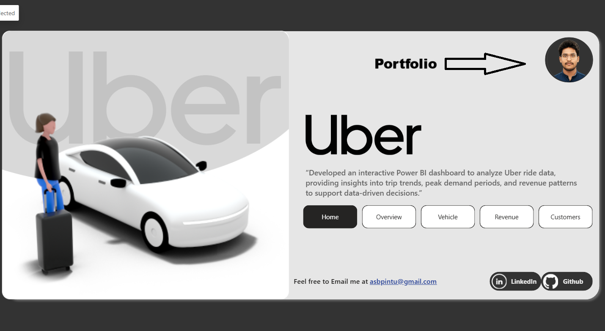
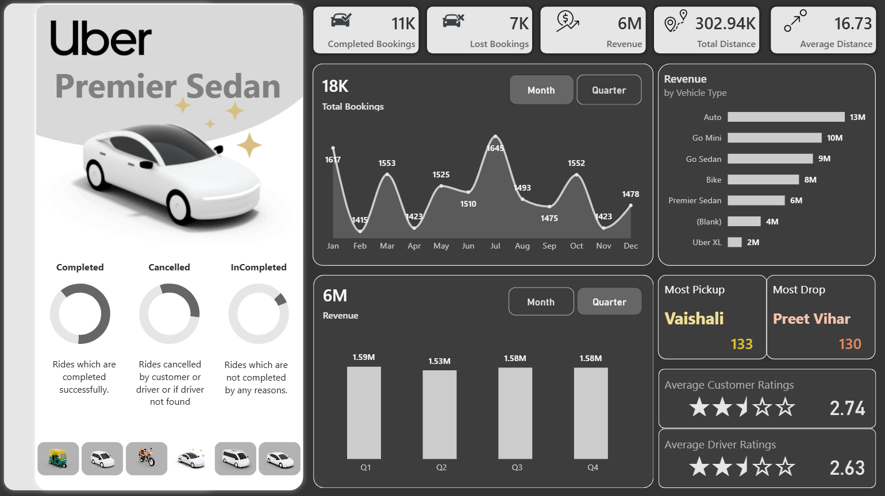
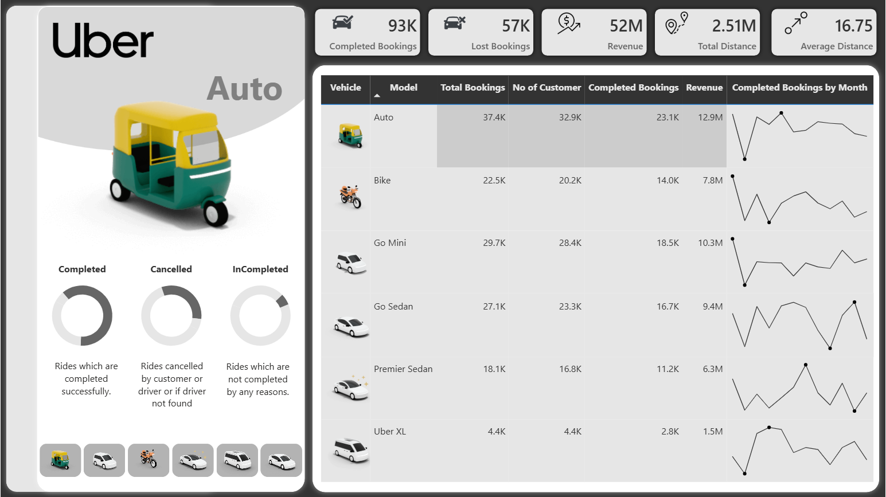
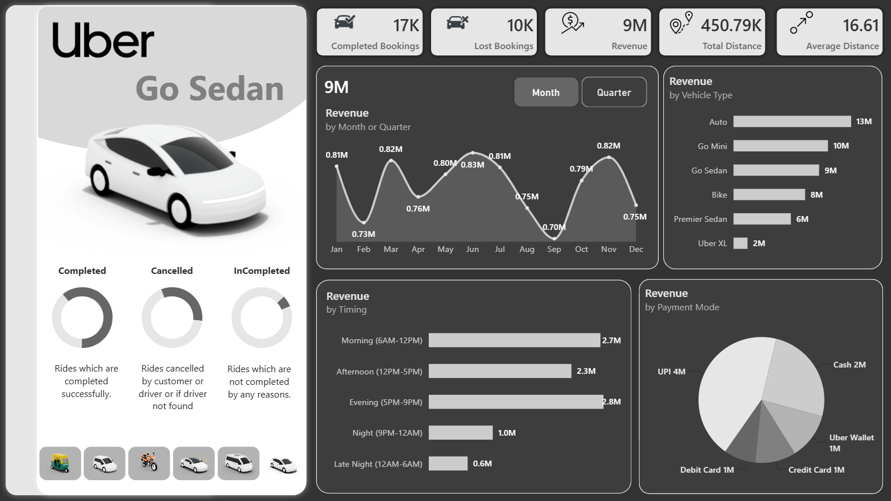
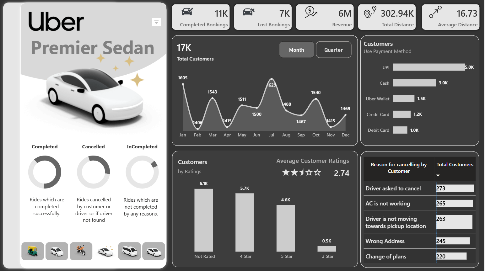

Poewr BI Dashboard link : [Click to view the Dashboard](https://app.powerbi.com/view?r=eyJrIjoiNGEyNzQ0ODgtMzg4Ni00ZWZjLThmZjQtMjI2ZmRhYWVmNTI5IiwidCI6ImJjMmRjNzNhLWZhM2QtNGNiZS1iZGM4LWI0NjhjNDY0NjM2ZiJ9)


# 🚗 Uber Data Analysis - Intractive Dashboard - Python, Power BI, SQL


---



## 📌 Project Overview
This project showcases an interactive **Uber Data Analysis Dashboard** built in Power BI to analyze ride bookings, revenue trends, cancellations, and customer behavior.

The dashboard helps uncover **hidden operational issues and business insights** that can drive better decision-making.

---

## 🎯 Business Problem
Ride-hailing platforms face challenges such as:
- High ride cancellations
- Revenue
- Fluctuating demand  
- Customer dissatisfaction  
- Inefficient driver allocation  

👉 This project aims to identify these issues using data and provide actionable insights.

---

## 📊 Key Features & Insights

### 🔹 KPI Tracking
This section provides a high-level overview of platform performance, helping stakeholders quickly assess business health and efficiency.
- Total Bookings  
- Completed vs Cancelled Rides  
- Total Revenue  
- Total Distance  
- Average Ride Distance  
---



### 🚘 Vehicle Performance
Vehicle-wise analysis highlights how different ride categories contribute to overall demand and revenue.
- Auto segment drives maximum bookings & revenue  
- Premium rides contribute higher value per trip  

---
Poewr BI Dashboard link : [Click to view the Dashboard](https://app.powerbi.com/view?r=eyJrIjoiNGEyNzQ0ODgtMzg4Ni00ZWZjLThmZjQtMjI2ZmRhYWVmNTI5IiwidCI6ImJjMmRjNzNhLWZhM2QtNGNiZS1iZGM4LWI0NjhjNDY0NjM2ZiJ9)



### 📈 Time-Based Insights
Time analysis reveals demand patterns and helps identify peak operational hours.
- Peak demand during **morning & evening commute hours**  
- Seasonal trends visible across months and quarters  

---

### 💰 Revenue Analysis
Revenue insights help identify the most profitable segments and time periods.
- Revenue by vehicle type  
- Revenue by time of day  
- High revenue generated during peak hours  

---
Poewr BI Dashboard link : [Click to view the Dashboard](https://app.powerbi.com/view?r=eyJrIjoiNGEyNzQ0ODgtMzg4Ni00ZWZjLThmZjQtMjI2ZmRhYWVmNTI5IiwidCI6ImJjMmRjNzNhLWZhM2QtNGNiZS1iZGM4LWI0NjhjNDY0NjM2ZiJ9)



### ❌ Cancellation Insights
This section uncovers the root causes behind lost bookings and operational inefficiencies.
- Driver asked to cancel  
- Driver not moving  
- AC issues  
- Wrong address  

> 🚨 Most cancellations are driven by **operational issues rather than customer decisions**

---



### ⭐ Ratings Analysis
Ratings analysis reflects overall service quality and customer experience.
- Customer Rating: ~2.74  
- Driver Rating: ~2.63  

> ⚠️ Indicates scope for improving **service quality and user satisfaction**

---

### 💳 Payment Trends
Payment behavior shows customer preferences and adoption of digital methods.
- UPI is the most preferred payment method  
- Followed by Cash, Wallet, Cards  

> 💡 Strong shift toward **cashless transactions**

---

### 📍 Location Insights
Location analysis helps identify high-demand areas for better resource allocation.
- Top Pickup Location: Vaishali  
- Top Drop Location: Preet Vihar  

---
Poewr BI Dashboard link : [Click to view the Dashboard](https://app.powerbi.com/view?r=eyJrIjoiNGEyNzQ0ODgtMzg4Ni00ZWZjLThmZjQtMjI2ZmRhYWVmNTI5IiwidCI6ImJjMmRjNzNhLWZhM2QtNGNiZS1iZGM4LWI0NjhjNDY0NjM2ZiJ9)

---

### 🎛️ Dashboard UX Enhancement
To improve user experience and interactivity, a dynamic navigation feature is implemented.
- Added a **Menu Toggle Button** across all pages  
- Allows users to **show/hide slicers dynamically**  
- Enhances dashboard cleanliness and usability  
- Provides a more **app-like interactive experience**  

> 🚀 This feature ensures better focus on visuals while keeping filters easily accessible 

---


---
Poewr BI Dashboard link : [Click to view the Dashboard](https://app.powerbi.com/view?r=eyJrIjoiNGEyNzQ0ODgtMzg4Ni00ZWZjLThmZjQtMjI2ZmRhYWVmNTI5IiwidCI6ImJjMmRjNzNhLWZhM2QtNGNiZS1iZGM4LWI0NjhjNDY0NjM2ZiJ9)

---


## 🎯 Key Business Insights (Storytelling)

🔍 This analysis goes beyond numbers to uncover **real business problems and opportunities** within Uber operations.

- 🚘 **Auto is the backbone of the platform**  
  High volume and consistent revenue from Auto rides indicate strong dependence on the budget segment.

- ⏰ **Demand is highly predictable and time-driven**  
  Peak usage during morning and evening highlights the importance of optimizing driver supply during commute hours.

- ❌ **Cancellations are a major revenue leakage point**  
  A significant portion of lost bookings is driven by operational issues like driver delays and service quality gaps.

- ⭐ **Customer experience needs immediate attention**  
  Low ratings from both customers and drivers signal dissatisfaction, which can impact long-term retention.

- 💳 **Digital payments are dominating user behavior**  
  The strong preference for UPI reflects a shift toward a cashless ecosystem and faster transactions.

- 📍 **Demand is concentrated in specific locations**  
  Identifying pickup and drop hotspots enables better driver allocation and reduced waiting times.

- 🚀 **Operational efficiency is the biggest opportunity**  
  Improving driver behavior, reducing cancellations, and enhancing service quality can directly boost revenue and user satisfaction.

---

💡 **Final Insight:**  
This dashboard highlights that the biggest growth opportunity is not just increasing demand, but **fixing operational inefficiencies to convert more bookings into successful rides**.

Poewr BI Dashboard link : [Click to view the Dashboard](https://app.powerbi.com/view?r=eyJrIjoiNGEyNzQ0ODgtMzg4Ni00ZWZjLThmZjQtMjI2ZmRhYWVmNTI5IiwidCI6ImJjMmRjNzNhLWZhM2QtNGNiZS1iZGM4LWI0NjhjNDY0NjM2ZiJ9)

---


## 🚀 Business Recommendations

Based on the insights derived from the dashboard, the following actions are recommended to improve performance and user experience:


### 🎯 1. Reduce Ride Cancellations (Top Priority)
Cancellations are the biggest source of revenue loss and customer dissatisfaction.

**Recommendations:**
- Implement stricter policies for drivers cancelling rides  
- Introduce penalties for frequent cancellations  
- Provide incentives for high ride acceptance & completion rates  
- Enable real-time driver tracking alerts for customers  


### 🚘 2. Optimize Driver Allocation During Peak Hours
Demand is highly concentrated during commute hours.

**Recommendations:**
- Increase driver availability during morning & evening peaks  
- Introduce surge pricing strategically to balance demand-supply  
- Use predictive analytics to forecast demand and allocate drivers  


### ⭐ 3. Improve Customer Experience & Ratings
Low ratings indicate dissatisfaction with ride quality and service.

**Recommendations:**
- Introduce driver quality monitoring systems  
- Provide training programs for drivers (behavior, service quality)  
- Improve vehicle standards (AC, cleanliness, comfort)  
- Offer in-app feedback resolution for faster issue handling  


### 💳 4. Strengthen Digital Payment Ecosystem
UPI is the dominant payment mode.

**Recommendations:**
- Provide cashback/offers on UPI payments  
- Reduce friction in digital transactions  
- Promote wallet integrations and seamless checkout experience  


### 📍 5. Focus on High-Demand Locations
Demand is concentrated in specific pickup and drop areas.

**Recommendations:**
- Position more drivers near high-demand zones  
- Introduce location-based incentives for drivers  
- Optimize routing and reduce waiting time in these areas  


### 🚀 6. Improve Operational Efficiency
Operational gaps are directly impacting conversions and revenue.

**Recommendations:**
- Monitor driver behavior using performance dashboards  
- Reduce driver idle time and improve ride matching algorithms  
- Implement AI-based recommendations for ride allocation  


## 💡 Final Recommendation
Instead of only focusing on increasing bookings, Uber should prioritize:

👉 **Converting existing demand into successful rides by reducing cancellations and improving service quality**

This will directly lead to:
- Higher revenue  
- Better customer retention  
- Improved platform reliability  

---
Poewr BI Dashboard link : [Click to view the Dashboard](https://app.powerbi.com/view?r=eyJrIjoiNGEyNzQ0ODgtMzg4Ni00ZWZjLThmZjQtMjI2ZmRhYWVmNTI5IiwidCI6ImJjMmRjNzNhLWZhM2QtNGNiZS1iZGM4LWI0NjhjNDY0NjM2ZiJ9)

---

## 🛠️ Tech Stack
- Power BI
- Python
- SQL Server
- DAX (Data Analysis Expressions)  
- Data Modeling  
- Data Visualization  

---

## 📂 Project Structure

```
📁 Uber-Data-Analysis
│
├── 📁 dashboards
│   └── Uber Data Analysis Dashboard.pbix
│
├── 📁 data
│   ├── rides.csv
│   └── vehicles.csv
│
├── 📁 sql
│   └── SQLQuery.sql
│
├── 📁 notebooks
│   └── data_exploration.ipynb
│
├── 📁 src
│   ├── __init__.py
│   ├── db_engine.py        # Database connection
│   ├── logger.py           # Logging setup
│   ├── utils.py            # Helper functions
│   └── data_processing.py  # Cleaning / transformation logic
│
├── 📁 assets
|   ├── home.png
│   ├── overview.png
│   ├── vehicle.png
│   ├── revenue.png
│   ├── customer.png
│   ├── menu button.png
│   └── menu slicers.png
│
├── 📁 docs
│   ├── project_notes.md
│   └── business_requirements.md
│
├── 📁 logs
│   └── logs.log
│
├── 📄 main.py
├── 📄 requirements.txt
├── 📄 .env
├── 📄 .gitignore
├── 📄 LICENSE
├── 📄 README.md
└── 📄 README_INFO.md

```

## 🚀 How to Use
1. Download the `.pbix` file from Dashboards
2. Open in Power BI Desktop  
3. Interact with filters and slicers at Menu button
4. Explore insights  

---
Poewr BI Dashboard link : [Click to view the Dashboard](https://app.powerbi.com/view?r=eyJrIjoiNGEyNzQ0ODgtMzg4Ni00ZWZjLThmZjQtMjI2ZmRhYWVmNTI5IiwidCI6ImJjMmRjNzNhLWZhM2QtNGNiZS1iZGM4LWI0NjhjNDY0NjM2ZiJ9)

---

## 🏁 Conclusion

This project demonstrates how data can be transformed into meaningful insights to solve real-world business challenges in a ride-hailing platform.

Through this analysis, it becomes clear that while demand for rides is strong and consistent, the primary challenge lies in **operational inefficiencies**, particularly ride cancellations and service quality issues. These factors directly impact revenue, customer satisfaction, and platform reliability.

The dashboard not only highlights performance metrics but also uncovers **hidden gaps in driver behavior, customer experience, and demand-supply alignment**. By addressing these areas, Uber can significantly improve ride completion rates and overall efficiency.

💡 **Key Takeaway:**  
The biggest opportunity for growth is not just acquiring more users, but **optimizing existing operations to convert demand into successful rides**.

🚀 This project reflects the power of data analytics in enabling **data-driven decision-making**, improving business outcomes, and enhancing user experience.

---

## 📬 Contact
If you have any questions or feedback, feel free to connect:

📧 Email: [ardhendushekhar424@gmail.com](mailto:ardhendushekhar424@gmail.com)

💼 LinkedIn: [https://www.linkedin.com/in/asbpintu](https://www.linkedin.com/in/asbpintu/)

---

## ⭐ If you like this project
Give it a ⭐ on GitHub and share your feedback!

Thank You !!!
---